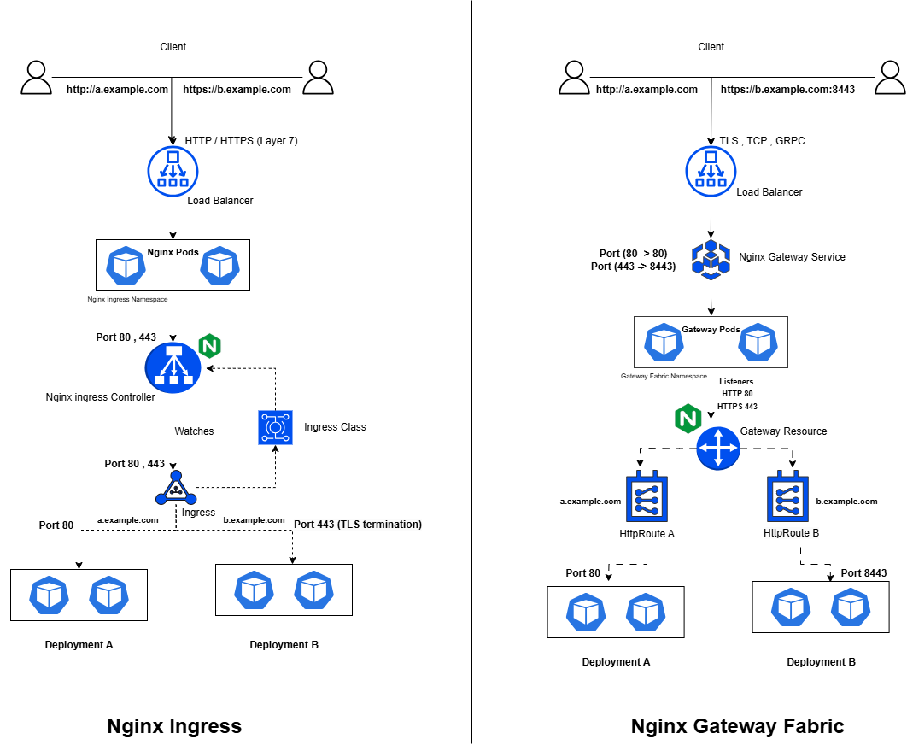

# Nginx Ingress Vs Gateway Fabric- A brief Analysis

As Kubernetes continues to evolve, organizations are increasingly relying on robust ingress controllers and API gateway solutions to manage their microservices architectures. NGINX, a leader in the space, offers two distinct solutions that cater to different use cases: NGINX Ingress Controller and NGINX Gateway Fabric. While both are built on NGINX’s high-performance web server, they differ significantly in their architecture, functionalities, and the challenges they aim to solve. I have been working with Ingress for quite some time and I have just recently discovered the nginx specific implementation of the Gateway API. I'll dive into a detailed comparison between these two powerful tools to help you understand when and why you might choose one over the other in your Kubernetes environment.

### ✅ Multi-Role Management

The Nginx ingress Resource was not focused on Role based Control and was basically designed to be used by the kubernetes administrator. However, this approach doesn't align with the needs of many organizations, where multiple teams, such as application developers, platform operators, and security administrators, own different parts of the ingress setup while working collaboratively on application development and delivery. The Gateway API solves this by introducing a multi-role model, enabling easier delegation of responsibilities across various teams.

### ✅ Simplified Feature Expansion

A common challenge with many Ingress implementations is the extensive use of annotations and custom resource definitions (CRDs). These are often necessary to enable features like header-based matching, traffic weighting, and multi-protocol support, which aren't natively available in the Ingress resource. Suppose you want to increase timeout, different ingress implementations have different annotations for this but this also introduces complexity. While CRDs and annotations offer flexibility, they can also complicate management and integration. The Gateway API simplifies this by incorporating these advanced capabilities directly into the core API standard, providing a more streamlined, consistent approach for handling complex traffic management features without relying on external configurations.

### ✅ Expanded Protocol Support
One of the key limitations of the traditional Ingress resource is that it primarily focuses on Layer 7 (HTTP/HTTPS) traffic, offering features suited for web applications. While this is sufficient for many use cases, it falls short when dealing with non-HTTP protocols or lower-level network traffic. The Gateway API, however, extends support beyond Layer 7, including native handling for Layer 4 protocols such as TCP, gRPC, and TLS. This enables more comprehensive traffic management across a wider range of applications, from web services to microservices that require more complex communication patterns or direct socket-level interactions.

## ⚡ Use Case: HTTPS with non-standard protocols

One of the main reasons I began exploring alternatives to NGINX was due to a requirement to run multiple web applications on Kubernetes, utilizing both HTTPS and non-standard ports. Since the NGINX Ingress Controller only supports Layer 7 traffic, there was no straightforward solution available to manage this setup without the overhead of rebuilding the Ingress controller itself.

After conducting further research, I discovered that while the NGINX Gateway Fabric does support TCP traffic, it lacks native support for TLS termination on those TCP connections, which did not align with my requirements.

I explored various solutions, but ultimately found a workaround that worked for my scenario.

In the `Gateway` resource, changing the port from the default 443 to a non-standard port did not work, as this configuration is not supported directly. However, I found that by keeping the port at 443 and modifying the port of the `GatewayService` to the desired non-standard port - while internally mapping it to port 443 on the `GatewayPod` - I could route traffic intended for port 443 to the specified non-standard port. Essentially, the traffic would arrive on port 443, then be redirected internally to the mapped non-standard port on the Gateway service.

This approach allowed me to bypass the limitation while maintaining the security features provided by TLS termination.

